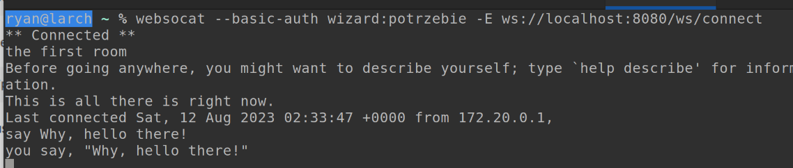
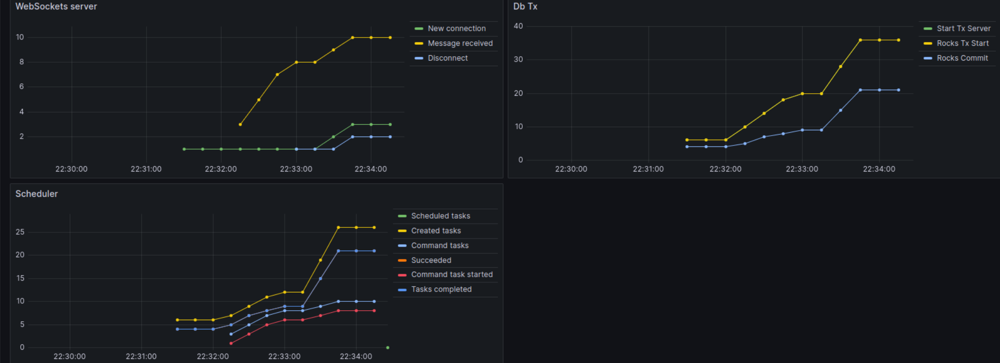

# 'moor'; lambdaMOO in Rust

(note: name is provisional and awful)

## Intent
Because I don't have enough incomplete projects ...

And in the general theme that all things get to be rewritten in Rust, because that is the way of things in the 2020s.

And scratching an itch of many years to build a more modern LambdaMOO inspired thing, without actually building a more
modern LambdaMOO inspired thing and instead just building LambdaMOO itself

### Well, only partially a jest...

The intent here is to start out at least fully compatible with LambdaMOO 1.8.x series and to be able to read and
execute existing cores. 

### But then...

... to actually implement the backend portions on a more modern foundation, with a proper disk-based 
transactionally safe database and full multithreaded concurrency, and replacing the classic `telnet` 
client connectivity with websockets and such.

### Current status

   * Mostly feature complete. Have tested against JaysHouseCore, and most of the functionality is there.
   * Objects are stored in a RocksDB database, and are transactionally safe and consistent.
   * Accepts inbound websocket connections (in lieux of telnet), accepts Basic-Auth login, attaches them to a user, 
     and executes commands.
     
   * Has an HTTP endpoint for retrieving some public properties (such as `$login.welcome_message`) etc.
   * A Read-Eval-Print loop can be brought up to work against the database, and can be used to poke around and 
     execute verbs and such.
   * And what's software without dashboards?

### Missing / Next steps before 1.0

   * Bugs, bugs, bugs. Collect em' all.
   * Missing features:
     * `recycle()` isn't implemented, so objects are never deleted.
     * Background tasks resumption after restart (from DB and from textdump load.)
     * Prompt-receiving network input for things like `@program` and password changes, etc.
     * Accept old-school "telnet" (raw ASCII TCP socket) connections.
     * Dump to a backup `textdump` format.
     * 'out of band' network command support, used by some cores/clients.
   * Improvements:
     * Performance improvements. Especially caching at the DB layer is missing and this thing will run dog slow 
       without it
     * A bit better connection management generally.
     * Better auth (SSO, OAuth2, etc?). Better crypt/password support.

## LambdaMOO is 30+ years old, why remain compatible?

* Because it's easy to go into the weeds creating new things, and never finishing. By having a concrete goal, and something
  to compare and test against, I may actually get somewhere.
* Because the *actual* useful and hard parts of those old MOO-type systems was the "user-space" type pieces (like
  LambdaCore/JHCore etc) and by making a new system run those old cores, there's more win.
* Because LambdaMOO itself is actually a very *complicated system with a lot of moving parts*; there's a compiler,  
  an object database, a virtual machine, a decompiler, and a network runtime all rolled into one. This, is, in some
  way... fun.

### Someday ...

Eventual new feature goals, after full MOO backwards compatibility has been achieved:

* Embedded JavaScript engine to allow implementation of MOO verbs in a more modern standard language.
* Extended protocol support, richer output than pure text (e.g. JSON events for clients to render, etc.)
* Distributed rather than local-only storage of objects.
* Incremental runtime / model changes.

Contributions are welcome and encouraged. 

Ryan (ryan.daum@gmail.com)
