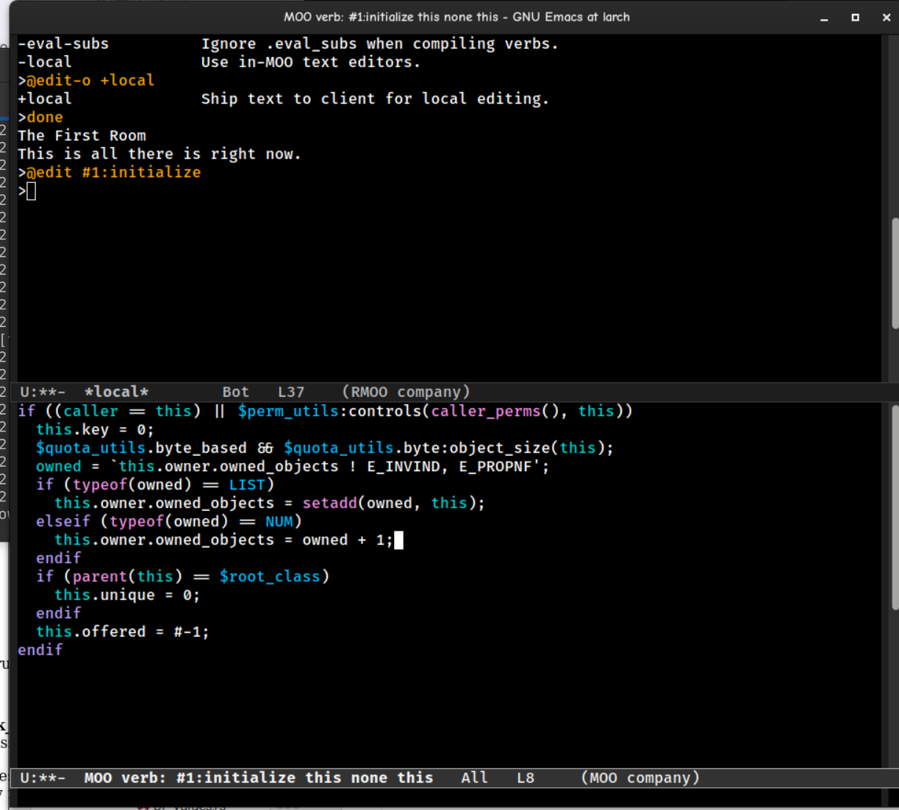

# 'moor'; lambdaMOO all over again.

"Moor" is a multi-user, programmable server, coded in Rust, designed to be able to run the original LambdaMOO core as a starting point, with various improvements at the server level to provide a more modern foundation for future development.

LambdaMOO is a MUD -- aka a shared, multi-user, text-based virtual world -- that first opened to the public in 1990 and is still in operation.  LambdaMOO was and remains unusual in that it is a highly programmable, persistent-world MUD.  In particular, LambdaMOO provides a dynamically programmable environment ("live coding" similar to Smalltalk) that supports programming by many users.

Unlike many MUDs, LambdaMOO is not solely focused on role playing games, although its programmability has enabled users to develop RPGs implemented inside LambdaMOO.)

Chances are if you landed here you already know all this, but I have a blurb here
[here](doc/lambda-background.md) briefly summarizing more about LambdaMOO and why it's interesting.

(note: "moor" name is provisional and awful, alternative suggestions accepted)

## Project goals / status

The intent here is to start out at least fully compatible with LambdaMOO 1.8.x series and to be able to read and
execute existing cores, and the 1.0 feature release is targeting this rather ambitious but also rather restricted goal.
(Primarily to maintain focus so I don't get distracted by the shiny things I've wanted to do for the last 30 years.)

### LambdaMOO is 30+ years old, why remain compatible?

* Because it's easy to go into the weeds creating new things, and never finishing. By having a concrete goal, and something
  to compare and test against, I may actually get somewhere.
* Because the *actual* useful and hard parts of those old MOO-type systems was the "user-space" type pieces (like
  LambdaCore/JHCore etc) and by making a new system run those old cores, there's more win.
* Because LambdaMOO itself is actually a very *complicated system with a lot of moving parts*. There's a compiler,  
  an object database, a virtual machine, a decompiler, and a network runtime all rolled into one. This, is, in some
  way... fun.

### Current status / features

* Pretty much feature complete / compatible with LambdaMOO 1.8.1 with a few caveats (see below)
* Can load and run LambdaMOO 1.8.x cores.
* Have tested against JaysHouseCore, and most of the functionality is there. Bugs are becoming increasingly rare.
* Hosts websocket, "telnet" (classic line oriented TCP connection), and console connections. MCP clients work, with
  remove editing, etc.
* Objects are stored in a concurrent transactional object database -- safe, consistent and happy. The architecture 
  allows for cleanly adding different storage backends for new scenarios.
* Monitoring/metrics support via Prometheus-compatible export.
* Separate network-host vs daemon process architecture means that upgrades/restarts can happen in-place without
  dropping live connections.

Here's a screenshot of the `JaysHouseCore` world running in `moor`, connected to with the classic `rmoo` Emacs client,
editing a MOO verb:



## How do I use it?

The easiest way to get started is to run the `docker compose` setup. This will bring up a complete server with `telnet`
and `websocket` interfaces. The server will be setup with an initial `JaysHouseCore` core import, and will be set up with
metrics monitoring via Grafana and VictoriaMetrics.

To do this, take a look at the local `docker-compose.yml` file, instructions are there, but it really just amounts to:

```
    docker compose up
```

Then connect (with your favourite MUD/MOO client) to `localhost:8888` and follow the login instauctions. Classic 
clients like `TinyFugue` will work fine, and there are some newer clients like [BlightMud](https://github.com/Blightmud/Blightmud) 
that should work fine. (A partial -- and probably outdated list of clients -- can be found here: https://lisdude.com/moo/#clients)

Once you're familiar with how the docker setup works, you can get more creative. 

An actual production deployment can be fairly easily derived from the `docker-compose.yml` file, and the provided `Dockerfile`.

### Why would I use this instead of the original LambdaMOO server?

* Because it's new and shiny and fun.
* Because its codebase is more modern and easier to add to and maintain.
* Because it's getting ongoing development.
* Because it has an exciting future.

### Missing / Next steps before 1.0

* Bugs, bugs, bugs. Collect em' all.
* Generally, open issues / missing features can be seen here: https://github.com/rdaum/moor/issues (but there are also
  plenty of TODOs in the code not yet captured as issues.)
* Major missing features:
    * Quota support.
    * Background tasks resumption after restart (from DB and from textdump load.)
    * Dump to a backup `textdump` format (or some stable backup format for between-version migrations.)
    * `read`; This is used for prompts, password changes, editor, etc. It's slightly tricky
      because of the 'transactional' nature of I/O in Moor where all verb and I/O operations
      can be retried on transaction commit failure. Haven't decided what to do about this.
    * Actual transaction retry on commit-conflict. (Mainly because without actual users and stress testing I haven't
      been able to provoke this scenario to test against yet. The hooks are there, just not done.)
* Improvements needed:
    * Performance improvements. Especially caching at the DB layer is missing and this thing will run dog-slow
      without it
    * Better auth (SSO, OAuth2, etc?). Better crypt/password support.

### Unsupported features that might not get supported

* `encode_binary` & `decode_binary`:  These two functions allow for escaped binary
  sequences along with a network option for sending them, etc.
  But:
    * `moor`'s strings are utf8 so arbitrary byte sequences aren't going to cut it and
    * we're on a websocket, and have better ways of doing binary than encoding it into the
      output.
    * The alternative will be to provide a `binary` type that can be used for this purpose
      and to have special `notify` calls for emitting them to the client.
* Network connections, outbound and inbound (e.g. `open_network_connection`, `listen`,  
  `unlisten` etc). My intent is for the network service layer to be implemented at the Rust level, in the
  server daemon, not in MOO code.

### But then...

The following are targeted as eventual goals / additions once 1.0 (fall 2023) is out the door:

   * A richer front-end experience. Support for websockets as a connection method means that the server can provide 
   a richer narrative stream to browsers (with in-core support assistance.) A client which provides a full proper 
   UI experience with interactive UI components, graphical elements, and so on are the end-goal here.
   * Support for multiple programming language for programming MOO verbs/objects. The backend has been written such that
     this is feasible. Authoring verbs in JavaScript/TypeScript will be the first target, and WebAssembly modules are
     also a possibility. These verbs would still run within the same shared environment and use the same shared object
     environment, but would allow for a more modern programming experience.
   * A more scalable server architecture; the system right now is divided into separate "host" frontends for network  
     connections, and a common backend `daemon` which manages the database, virtual machine, and task scheduler. This
     can be further split up to permit a distributed database backend or distributing other components, to meet higher
     scalability goals if that is needed.
   * Enhancements to the MOO data model and language, to support a richer / smoother authoring experience. Some ideas 
     are:
     * Datalog-style relations / predicates; for managing logical relationships between entities. This could allow
       bidirectional (or more) relationships like already exist with e.g. `location`/`contents`, but more generalized,
       and to allow for making complex worlds easier to maintain.
     * Adding a map/dictionary type. MOO predates the existence of dictionary types as a standard type in most languages.  
       MOO's type system only has lists and uses "associative lists" for maps, which are a bit awkward. Immutable/CoW
       maps with an explicit syntax would be a nice addition. Other MOO offshoots (Stunt, etc.) do already provided this.
     * Adding a `binary` type. MOO's type system is very string-oriented, and there's not an elegant way to represent
       arbitrary binary data. (There's `encode_binary` and `decode_binary` builtins, but these are not the way I'd do it
       today.)
     * and so on

## License.

Currently licensed under the Apache 2.0 license. See LICENSE file for details.

## Contribute and help!

Contributions are welcome and encouraged.

Right now the best way to contribute is to run the system and report bugs, or to try to run your own LambdaMOO core
and report bugs. (Or to fix bugs and submit PRs!)

## Enjoy.

Ryan (ryan.daum @ gmail.com)
