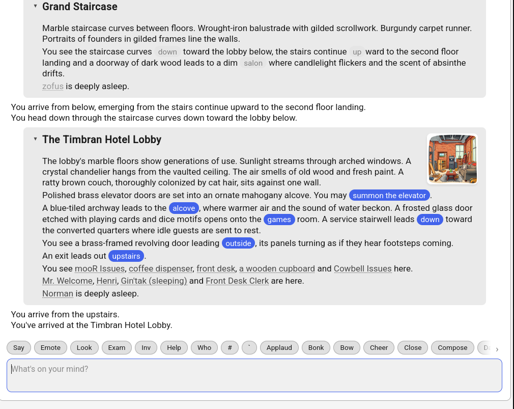

<p align="center"></p>

# mooR

[](https://github.com/sponsors/rdaum)

**mooR** is a network-accessible, multi-user, programmable system for building online social
environments, games, and collaborative spaces. Think of it as a virtual world where participants can
not only interact with each other, but also program and modify the environment itself.

mooR is a modern, from-scratch rewrite of [LambdaMOO](https://en.wikipedia.org/wiki/MOO),
maintaining full compatibility with existing LambdaMOO 1.8.x databases while adding significant
enhancements.

📖 **For comprehensive documentation, see our [mooR Book](https://timbran.org/book/html/).**

> **⚠️ 1.0-Beta Release:** mooR is in the 1.0-beta series, with stable database formats and APIs. If
> you are reading `main`, you're looking at pre-release/next-version work; stable releases live on
> the `1.0` release branch (with beta tags cut from it) and in the Releases tab / published images.
> See the [Status](#status) section below for details.
>
> See the
> [full announcement blog post for more...](https://timbran.org/announcing-moor-1-0-beta1.html)

> **📦 Repository Migration Notice (August 2025):** We've recently moved our primary repository from
> GitHub to [Codeberg](https://codeberg.org/timbran/moor). If you're viewing this on GitHub, please
> consider switching to Codeberg for the latest updates, issue tracking, and contributions.

## What is a MOO? And Why?

A MOO (Multi-User Object-Oriented) is a network-accessible, multi-user, programmable system for
building online social environments, games, and collaborative spaces. Think of it as a virtual world
where participants can not only interact with each other, but also program and modify the
environment itself.

MOOs offer a unique digital experience through:

- **Collaborative storytelling** where participants build a shared narrative
- **Live programming** - modify the world while you're in it
- **Community-driven development** through persistent interactions and relationships
- **Rich interaction** that engages users through both traditional command-line and modern web
  interfaces
- **Complete customizability** - everything from objects to commands can be programmed

What _mainly_ sets MOOs apart is their emphasis on live programming and community-driven content
creation - imagine if Minecraft's creative mode, Discord's community features, and a code editor all
lived in the same space. (Or for the more nerdy, imagine if a system like Smalltalk or similar could
be connected to by multiple people in real time, each contributing to a shared codebase.)

mooR is a modern, from-scratch rewrite of all of the above. It will happily import an existing
LambdaMOO (or some ToastStunt) database, but offers significant enhancements and modern conveniences
and is intended on bringing the whole experience into the future.

To see a live running instance, visit our demonstrator community at
["Timbran Hotel"](https://moo.timbran.org).

<p align="center"></p>

## Key Features & Enhancements

**Runtime improvements:**

- Fully multithreaded architecture for modern multicore systems
- Web frontend client
- Directory-based import/export format for version control integration
- Modular architecture for easier extension

**Language enhancements:**

- UTF-8 strings, 64-bit integers, binary values
- Proper boolean values (`true`/`false`)
- Maps: associative containers (`["key" -> "value"]`)
- Lexically scoped variables with `begin`/`end` blocks
- List/range comprehensions (`{x * 2 for x in [1..5]}`)
- Lambda functions: anonymous functions with closures (`{x, y} => x + y`)
- Symbol literals ('mysymbol) like Lisp/Scheme (optional)
- UUID object identifiers (optional)
- Anonymous objects with automatic garbage collection (optional)
- Lightweight immutable objects ("flyweights") (optional)

**Modern infrastructure:**

- Fast, durable, transactional database
- Support for multiple client protocols (web, telnet)
- Easy deployment via Docker

## Status

mooR is in the **1.0-beta** series, focusing on stability, bug fixes, and documentation. The core
runtime and database formats are considered "stable" but churn may still happen. It successfully
runs databases imported from LambdaMOO with real-world workloads and has passed extensive stress and
performance testing.

**Beta series policy**:

- `main` branch: pre-release/next-version development (new features land here first)
- `1.0` branch: stable release line (bug fixes, stability improvements, documentation)
- Bug fixes land on `main` first, then are cherry-picked to `1.0` when safe
- Beta tags are cut from the `1.0` branch; releases and images publish from there
- Database formats and APIs are now stable
- Ready for testing and feedback from users

**Repository**: The primary mooR repository is hosted on
[Codeberg](https://codeberg.org/timbran/moor) with a mirror on GitHub. All issues filed and pull
requests submitted need to come through Codeberg, and not GitHub.

## Quick Start

The easiest way to get started and see what we've made is by using our quick-start scripts. These
scripts automatically handle Docker setup, resource isolation, and feature flag configuration.

### Try out mooR with a Core

Choose one of the pre-configured cores to explore (the scripts will automatically fetch any missing
dependencies):

- **Cowbell** (Modern core with web-native features):
  ```bash
  ./scripts/start-moor-cowbell.sh
  ```
- **LambdaCore** (Classic LambdaMOO core, with slight modifications for a better experience in
  mooR):
  ```bash
  ./scripts/start-moor-lambdacore.sh
  ```

By default, these scripts use a higher performance **release** build. For a faster initial compile
during mooR development (but slower runtime performance), you can use the `--debug` flag:

```bash
./scripts/start-moor-cowbell.sh --debug
```

### Accessing the System

Once started, the services are available at:

- **Web Client**: [http://localhost:8080](http://localhost:8080)
- **Telnet Interface**: `telnet localhost 8888`

The system isolates runtime data for each core in its own directory (`run-cowbell/` or
`run-lambda-moor/`), ensuring you can switch between them without database pollution.

---

## What the services are

This starts four services:

- **moor-daemon**: The backend MOO service
- **moor-telnet-host**: Traditional telnet interface on port 8888
- **moor-web-host**: REST API and WebSocket server for web clients
- **moor-frontend**: Web client served via nginx on port 8080

Connect via:

- **Web**: [http://localhost:8080](http://localhost:8080)
- **Telnet**: `telnet localhost 8888`

The server comes pre-loaded with an extraction of LambdaCore, providing a ready-to-explore virtual
world.

For more detailed setup instructions, see the
[Docker Compose Setup](https://timbran.org/book/html/the-system/docker-compose-setup.html) section
in the mooR Book.

### Alternative: Frontend Development Setup

For frontend development and testing, you can run just the daemon and web client without Docker:

```bash
npm run full:dev
```

This starts the moor-daemon and web development server, accessible at
[http://localhost:3000](http://localhost:3000). This setup excludes telnet and provides
hot-reloading for frontend development, but it requires installing some dependencies. See
[the Meadow repository](https://codeberg.org/timbran/meadow) for details.

## Deployment Options

mooR provides multiple deployment configurations to suit different use cases:

### Development & Single-Machine Deployments

The root `docker-compose.yml` is designed for development and single-machine deployments. All
services run on the same host and communicate via **IPC (Unix domain sockets)**.

The recommended way to start this setup is via the core-specific scripts, which handle all
environment isolation and permissions for you.

To start in the background:

```bash
./scripts/start-moor-cowbell.sh -d
```

(Any additional flags like `-d` are passed directly to `docker compose up`).

Data for these deployments is consolidated under core-specific directories (e.g., `./run-cowbell/`),
keeping your project root clean.

### Testing Clustered Configuration

The `docker-compose.cluster.yml` file is an example configuration that demonstrates TCP-based
communication with CURVE encryption. It runs on a single machine but shows what a multi-machine
clustered setup would look like:

```bash
docker compose -f docker-compose.cluster.yml up -d
```

This uses TCP with CURVE encryption and enrollment tokens for host authentication. It's useful for
testing the clustered setup locally before deploying across actual separate machines.

For actual multi-machine production deployments, use Kubernetes (see future documentation) or deploy
Debian packages on separate servers.

### Production Deployment Configurations

The `deploy/` directory contains a series of production-ready configuration examples:

- **`telnet-only/`**: Minimal telnet-only setup for traditional MUD usage
- **`web-basic/`**: Web-enabled deployment with HTTP (for use behind reverse proxies)
- **`web-ssl/`**: Web-enabled deployment with HTTPS/TLS support
- **`debian-packages/`**: Native Debian/Ubuntu packages with systemd (no Docker)

All production configurations use IPC for single-machine deployments and include automated testing
scripts. See each deployment's README for specific setup instructions. If you run into problems with
these scripts, please file an issue on our
[Codeberg issue tracker](https://codeberg.org/timbran/moor/issues) as they may fall out of date with
the latest changes.

For testing the current state of these deployment scenarios:

```bash
cd deploy
./test-all.sh  # Test all deployment configurations
```

## For Developers & Contributors

mooR offers several opportunities for contribution. For detailed contribution guidelines, see
[CONTRIBUTING.md](CONTRIBUTING.md).

**Core Development** (Rust):

- Server architecture improvements
- New builtin functions
- Performance optimizations
- Protocol extensions

**World Building** (MOO language):

- Creating new cores and experiences
- Porting existing MOO content
- Building modern web-enabled interfaces

**Documentation & Testing**:

- Expanding the mooR Book
- Creating tutorials and examples
- Stress testing and bug reports

### Getting Involved

- **Issues**: Check our [Codeberg Issues](https://codeberg.org/timbran/moor/issues) for current
  needs
- **Discussion**: Join our [Discord](https://discord.gg/Ec94y5983z) community
- **Experience**: Visit the [Timbran Hotel](https://moo.timbran.org) and explore and code
- **Development**: See the [mooR Book](https://timbran.org/book/html/) for architecture details
- **Support**: Consider [sponsoring the project](https://github.com/sponsors/rdaum) to help with
  ongoing development

## Bug Reports

Found a bug or have a feature request? Please file an issue on our
[Codeberg issue tracker](https://codeberg.org/timbran/moor/issues). Bug reports from `main` are
welcome, but if you're looking for stability, use the `1.0` release branch.

When reporting bugs, please include:

- Steps to reproduce the issue
- Expected vs actual behavior
- Your system information (OS, Docker version if applicable)
- Version number and commit tag/hash
- Relevant log output or error messages

## Resources

- 📖 **[Complete Documentation](https://timbran.org/book/html/)** - The comprehensive mooR Book
- 🏗️ **[Server Architecture](https://timbran.org/book/html/moor-architecture.html)** - Technical
  overview
- 💻
  **[MOO Programming Language](https://timbran.org/book/html/the-moo-programming-language.html)** -
  Language reference
- 🚀 **[Running a Server](https://timbran.org/book/html/the-system/running-the-server.html)** -
  Deployment guide

## License

mooR is licensed under the GNU General Public License v3.0. See [LICENSE](./LICENSE) for details.

This ensures the software remains open and free, in keeping with the the original LambdaMOO project.
