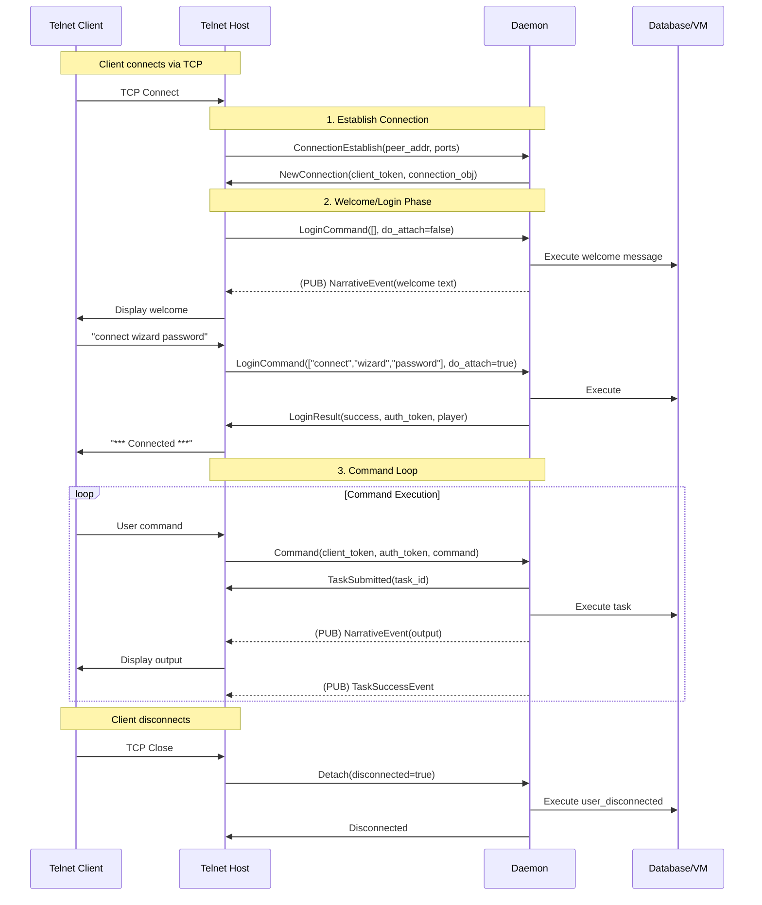
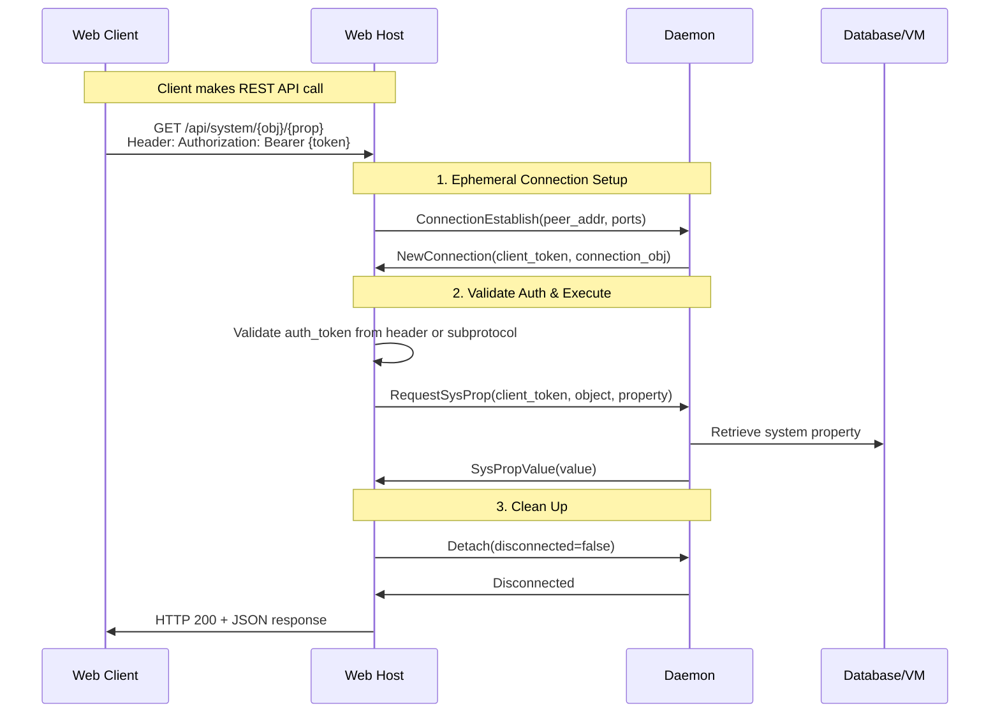
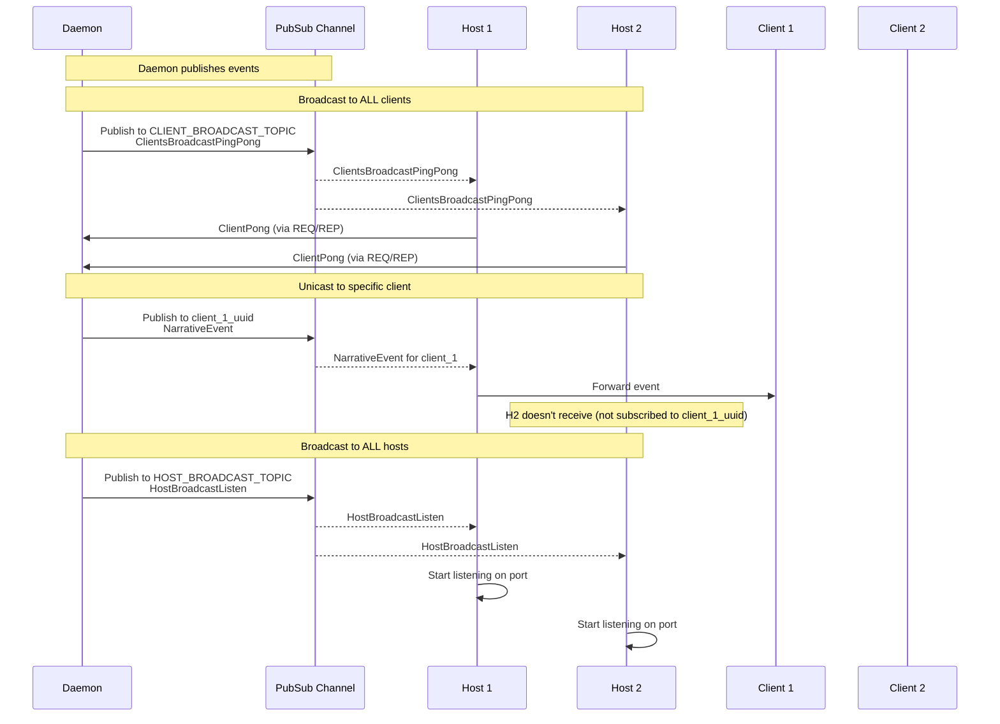

# mooR RPC API Specification

## Overview

This document provides a technical reference for the mooR RPC API. The API enables communication
between the daemon ( core server) and various client types: hosts (TCP/WebSocket connection
handlers), workers (external service handlers), and end-user clients.

All messages are serialized using [FlatBuffers](https://flatbuffers.dev/) as defined in
`crates/common/schema/moor_rpc.fbs`. For architectural context, see `doc/messaging.md`.

### Key Concepts

- **Daemon**: The core server process managing the database, VM, and task scheduling
- **Host**: A process handling client connections (e.g., telnet-host, web-host)
- **Worker**: A background process performing specialized tasks (e.g., HTTP requests)
- **Client**: An end-user connection managed by a host
- **Connection Object**: A negative object ID representing a client connection
- **Player Object**: A positive object ID representing an authenticated user

### Transport

The API uses [ZeroMQ](https://zeromq.org/) with two patterns:

1. **[Request-Reply](https://zeromq.org/socket-api/#request-reply-pattern) (REQ/REP)**: For direct
   host/worker → daemon communication
2. **[Publish-Subscribe](https://zeromq.org/socket-api/#publish-subscribe-pattern) (PUB/SUB)**: For
   daemon → host/client/worker broadcasts

### Transport Security

ZeroMQ communication security depends on the endpoint type:

#### TCP Endpoints (Encrypted)

When using TCP endpoints (e.g., `tcp://0.0.0.0:7899`), all communication is secured using
**CurveZMQ** encryption:

- **CURVE Protocol**: Uses Curve25519 elliptic curve cryptography for encryption and authentication
- **ZAP Authentication**: The daemon validates connecting hosts/workers via ZeroMQ Authentication
  Protocol (ZAP)
- **Key Exchange**: Each host/worker has a unique CURVE keypair; public keys are registered during
  enrollment
- **Encryption**: All messages are encrypted end-to-end with ephemeral session keys
- **Enrollment Flow**:
  1. Host/worker generates CURVE keypair on first run
  2. Connects to enrollment endpoint (default: `tcp://0.0.0.0:7900`) with enrollment token
  3. Registers service type, hostname, and CURVE public key with daemon
  4. Daemon stores public key in `~/.moor/allowed-hosts/{uuid}` for ZAP validation
  5. All subsequent ZMQ connections (RPC, PUB/SUB) use CURVE encryption

This ensures that:

- Messages cannot be intercepted or read in transit
- Only enrolled hosts/workers with registered public keys can connect
- The daemon can verify the identity of each connecting client

#### IPC Endpoints (No Encryption)

When using IPC endpoints (e.g., `ipc:///tmp/moor_rpc.sock`), CURVE encryption is **disabled**:

- **Filesystem Security**: Unix domain sockets rely on filesystem permissions for access control
- **Local-Only**: Communication never leaves the local machine
- **No Enrollment for CURVE**: Hosts/workers skip CURVE key registration (enrollment endpoint still
  needed for PASETO tokens)
- **Performance**: Lower latency and higher throughput than encrypted TCP

---

## Understanding the mooR Object System

Before diving into the message specifications, it's important to understand the mooR object model
and execution semantics, as they inform how the API works.

### The MOO Object Model

mooR is a **persistent object-oriented virtual environment**. Everything in the world is an object,
including rooms, items, players, and even abstract concepts. Objects have:

- **Properties**: Named values that store data (e.g., `name`, `description`, `weight`)
- **Verbs**: Named procedures (methods) written in MOO code that define behavior
- **Parents**: Objects inherit properties and verbs from parent objects (prototype inheritance)
- **Permissions**: Every object, property, and verb has an owner and permission flags controlling
  who can read, write, or execute them

The system maintains a **shared, persistent database** of these objects that all users interact with
simultaneously.

### Fundamental Data Types

The API uses several core types throughout:

#### Obj

Object identifiers are signed 64-bit integers:

- **Positive IDs** (`#1`, `#2`, etc.): World objects and authenticated players
- **Negative IDs** (`#-1`, `#-2`, etc.): Unauthenticated connection objects
- **`#0`**: The system object (typically `SYSTEM_OBJECT`)

```flatbuffers
struct Obj {
    id: int64;
}
```

#### ObjectRef

A flexible way to reference objects:

- **By ID**: Direct numeric reference (e.g., `#123`)
- **By Name**: Named reference (e.g., `$thing`, `$room`) - resolved at runtime

```flatbuffers
union ObjectRefUnion {
    Id,           // Direct object ID
    Name          // Named reference like "$player"
}
```

#### Var

The MOO type system's universal value type - a tagged union that can hold:

- **Integers**: 64-bit signed integers
- **Floats**: 64-bit IEEE floating point
- **Strings**: UTF-8 text
- **Objects**: Object references (Obj)
- **Errors**: Error codes (e.g., `E_PERM`, `E_INVARG`)
- **Lists**: Ordered collections of Vars
- **Maps**: Key-value associations

#### VarBytes

Serialized Var data in FlatBuffer format:

```flatbuffers
table VarBytes {
    data: [uint8];
}
```

Used for efficiently transmitting MOO values over the wire.

#### Symbol

Interned string identifiers used for property names, verb names, etc. These are transmitted as
strings but become interned on the daemon side.

```flatbuffers
table Symbol {
    value: string;
}
```

### Task Execution Model

**Critical concept**: Most API operations that execute MOO code are **asynchronous**.

When you submit a command or verb invocation:

1. **Submit Request**: Send a message like `Command` or `InvokeVerb`
2. **Immediate Response**: Receive `TaskSubmitted` with a `task_id`
3. **Wait for Events**: The actual result arrives later via PUB/SUB events:
   - `TaskSuccessEvent(task_id, result)` - Task completed successfully
   - `TaskErrorEvent(task_id, error)` - Task failed
   - `NarrativeEvent(...)` - Output generated during execution

**Why asynchronous?** MOO code execution can:

- Take significant time (seconds or more)
- Generate multiple outputs during execution
- Call other verbs recursively
- Be interrupted or suspended

The request-reply pattern would timeout or block, so the API uses event-driven completion.

### Transaction Isolation

**Each task submission gets its own serializable database transaction.**

- Tasks execute with a **consistent snapshot** of the database
- Multiple tasks can run concurrently without interfering with each other
- If transactions conflict (e.g., both modify the same property), one task retries automatically
- Changes are committed atomically when the task completes successfully
- If a task fails or is aborted, all changes are rolled back

This provides ACID guarantees similar to a traditional database, ensuring data consistency even
under heavy concurrent load.

### Connection Lifecycle

Understanding the distinction between connections and players is essential:

1. **Initial Connection** (`ConnectionEstablish`):
   - Creates a **connection object** with a negative Obj ID (e.g., `#-1`)
   - Represents an unauthenticated session
   - Given a `ClientToken` for subsequent requests

2. **Authentication** (`LoginCommand`):
   - Executes MOO code (typically `#0:do_login_command`)
   - On success, associates the connection with a **player object** (positive ID)
   - Returns an `AuthToken` for authenticated requests

3. **Authenticated Operations**:
   - Most operations require both `ClientToken` and `AuthToken`
   - Commands execute with the player's permissions
   - Multiple connections can share the same player (multi-session)

4. **Disconnection** (`Detach`):
   - Removes the connection
   - Optionally triggers `user_disconnected` MOO verb

### Common API Usage Patterns

The RPC API supports several interaction patterns:

#### 1. Long-lived Interactive Sessions (Telnet-style)

```
ConnectionEstablish → NewConnection
  ↓
LoginCommand → LoginResult (with AuthToken)
  ↓
Loop:
  Command → TaskSubmitted
    → NarrativeEvent (output)
    → TaskSuccessEvent
  ↓
Detach → Disconnected
```

**Use case**: Traditional MUD clients, chat sessions

#### 2. Ephemeral Request-Response (REST API-style)

```
ConnectionEstablish → NewConnection
  ↓
RequestSysProp/Eval → Result
  ↓
Detach → Disconnected
```

**Use case**: Web API calls, property queries, stateless operations

#### 3. Persistent WebSocket Sessions

```
Attach (with existing AuthToken) → AttachResult
  ↓
Bidirectional communication:
  Client → Command
  Daemon → NarrativeEvent, RequestInputEvent, etc.
  ↓
Detach → Disconnected
```

**Use case**: Rich web applications, persistent bidirectional communication

#### 4. Programming/Development Operations

```
Authenticated session:
  Verbs → List available verbs
  Retrieve → Get verb code
  Program → Update verb code
  Properties → List properties
  Retrieve → Get property value
```

**Use case**: MOO code editors, object browsers, programming tools

See the [Message Flow Diagrams](#message-flow-diagrams) section for detailed sequence diagrams of
these patterns.

### Authentication

The API uses [PASETO](https://github.com/paragonie/paseto) (Platform-Agnostic SEcurity TOkens) v4
with asymmetric cryptography for secure authentication. PASETO provides authenticated, encrypted
tokens that are immune to common JWT vulnerabilities. We use public-key signatures to ensure tokens
cannot be forged, and each token type has a specific footer to prevent type confusion attacks.

Token types:

- **HostToken**: Authenticates hosts to the daemon
- **ClientToken**: Tracks client connections
- **AuthToken**: Authenticates users (players)
- **WorkerToken**: Authenticates workers to the daemon

Each token type has a specific footer constant and is validated on each request.

---

## Host-to-Daemon Messages

Hosts send these messages to the daemon via REQ/REP socket.

### Message Envelope

```flatbuffers
table MessageType {
    message: MessageTypeUnion (required);
}

union MessageTypeUnion {
    HostToDaemonMsg,
    HostClientToDaemonMsg
}

table HostToDaemonMsg {
   host_token: HostToken (required);
   message: HostToDaemonMessage (required);
}
```

### RegisterHost

Registers a host with the daemon, providing information about listeners.

**Message Type**: `HostToDaemonMessage::RegisterHost`

**Fields**:

```flatbuffers
table RegisterHost {
    timestamp: uint64;           // SystemTime as nanos since UNIX epoch
    host_type: HostType;         // TCP or WebSocket
    listeners: [Listener];       // List of active listeners
}

table Listener {
    handler_object: Obj;         // Object handling connections
    socket_addr: string;         // SocketAddr as string (e.g., "127.0.0.1:8080")
}

enum HostType: uint8 {
    TCP = 0,
    WebSocket = 1
}
```

**Response**: `DaemonToHostReply::DaemonToHostAck`

**Usage**: Called when a host starts up to register itself with the daemon.

---

### HostPong

Response to a daemon ping, confirming the host is alive.

**Message Type**: `HostToDaemonMessage::HostPong`

**Fields**:

```flatbuffers
table HostPong {
    timestamp: uint64;           // SystemTime as nanos since UNIX epoch
    host_type: HostType;
    listeners: [Listener];
}
```

**Response**: `DaemonToHostReply::DaemonToHostAck`

**Usage**: Sent in response to `HostBroadcastEvent::HostBroadcastPingPong` to indicate liveness.

---

### RequestPerformanceCounters

Requests performance metrics from the daemon.

**Message Type**: `HostToDaemonMessage::RequestPerformanceCounters`

**Fields**: (none)

**Response**: `DaemonToHostReply::DaemonToHostPerfCounters`

```flatbuffers
table DaemonToHostPerfCounters {
    timestamp: uint64;
    counters: [CounterCategory];
}

table CounterCategory {
    category: Symbol;            // e.g., "sched", "db", "bf"
    counters: [Counter];
}

table Counter {
    name: Symbol;                // Operation name
    count: int64;                // Number of invocations
    total_cumulative_ns: int64;  // Total time spent in nanoseconds
}
```

**Usage**: Used for monitoring and diagnostics.

---

### DetachHost

Notifies the daemon that the host is shutting down.

**Message Type**: `HostToDaemonMessage::DetachHost`

**Fields**: (none)

**Response**: `DaemonToHostReply::DaemonToHostAck`

**Usage**: Called when a host process is terminating gracefully.

---

## Client-to-Daemon Messages

Clients send these messages via their host, which wraps them in `HostClientToDaemonMsg`.

### Message Envelope

```flatbuffers
table HostClientToDaemonMsg {
   client_data: [uint8];                        // Opaque data for host use
   message: HostClientToDaemonMessage;
}

table HostClientToDaemonMessage {
message: HostClientToDaemo  nMessageUnion (required);
}
```

### ConnectionEstablish

Creates a new connection object for a client.

**Message Type**: `HostClientToDaemonMessage::ConnectionEstablish`

**Fields**:

```flatbuffers
table ConnectionEstablish {
    peer_addr: string;                           // Client IP address
    local_port: uint16;                          // Local port
    remote_port: uint16;                         // Remote port
    acceptable_content_types: [Symbol];          // Optional content types
    connection_attributes: [ConnectionAttribute]; // Optional initial attributes
}

table ConnectionAttribute {
    key: Symbol;
    value: VarBytes;
}
```

**Response**: `DaemonToClientReply::NewConnection`

```flatbuffers
table NewConnection {
    client_token: ClientToken;                   // Token for future requests
    connection_obj: Obj;                         // Connection object (negative ID)
}
```

**Usage**: First message from a new client connection. Creates a connection object and returns a
client token.

---

### RequestSysProp

Requests a system property value (used during connection setup).

**Message Type**: `HostClientToDaemonMessage::RequestSysProp`

**Fields**:

```flatbuffers
table RequestSysProp {
    client_token: ClientToken;
    object: ObjectRef;                           // Object to query
    property: Symbol;                            // Property name
}
```

**Response**: `DaemonToClientReply::SysPropValue`

```flatbuffers
table SysPropValue {
    value: VarBytes;                             // Optional property value (none if not found)
}
```

**Usage**: Used by hosts to retrieve system properties during connection establishment.

---

### LoginCommand

Executes the login command to authenticate a user.

**Message Type**: `HostClientToDaemonMessage::LoginCommand`

**Fields**:

```flatbuffers
table LoginCommand {
    client_token: ClientToken;
    handler_object: Obj;                         // Object handling login (usually #0)
    connect_args: [string];                      // Login arguments (e.g., ["connect", "wizard", "password"])
    do_attach: bool;                             // Whether to attach after login
}
```

**Response**: `DaemonToClientReply::LoginResult`

```flatbuffers
table LoginResult {
    success: bool;
    auth_token: AuthToken;                       // Present if success=true
    connect_type: ConnectType;                   // Connected/Reconnected/Created
    player: Obj;                                 // Player object if success=true
}

enum ConnectType: uint8 {
    Connected = 0,
    Reconnected = 1,
    Created = 2,
    NoConnect = 255                              // For transient sessions
}
```

**Usage**: Authenticates a user via MOO code (typically `#0:do_login_command`).

---

### Attach

Attaches to an already-authenticated session using an auth token.

**Message Type**: `HostClientToDaemonMessage::Attach`

**Fields**:

```flatbuffers
table Attach {
    auth_token: AuthToken;
    connect_type: ConnectType;                   // 255 (NoConnect) for transient sessions
    handler_object: Obj;
    peer_addr: string;
    local_port: uint16;
    remote_port: uint16;
    acceptable_content_types: [Symbol];
}
```

**Response**: `DaemonToClientReply::AttachResult`

```flatbuffers
table AttachResult {
    success: bool;
    client_token: ClientToken;
    player: Obj;
}
```

**Usage**: Used for reconnecting or creating additional connections for an authenticated user.

---

### Command

Executes a MOO command.

**Message Type**: `HostClientToDaemonMessage::Command`

**Fields**:

```flatbuffers
table Command {
    client_token: ClientToken;
    auth_token: AuthToken;
    handler_object: Obj;
    command: string;                             // The command to execute
}
```

**Response**: `DaemonToClientReply::TaskSubmitted`

```flatbuffers
table TaskSubmitted {
    task_id: uint64;                             // Task ID for tracking
}
```

**Events**:

- `ClientEvent::TaskSuccessEvent` when task completes successfully
- `ClientEvent::TaskErrorEvent` if task fails
- `ClientEvent::NarrativeEventMessage` for narrative output

**Usage**: The primary way users interact with the MOO.

---

### Eval

Evaluates a MOO expression (typically for debugging/programming).

**Message Type**: `HostClientToDaemonMessage::Eval`

**Fields**:

```flatbuffers
table Eval {
    client_token: ClientToken;
    auth_token: AuthToken;
    expression: string;                          // MOO expression to evaluate
}
```

**Response**: `DaemonToClientReply::EvalResult`

```flatbuffers
table EvalResult {
    result: VarBytes;                            // Result value
}
```

**Usage**: Used for quick expression evaluation without command parsing.

---

### InvokeVerb

Directly invokes a verb on an object.

**Message Type**: `HostClientToDaemonMessage::InvokeVerb`

**Fields**:

```flatbuffers
table InvokeVerb {
    client_token: ClientToken;
    auth_token: AuthToken;
    object: ObjectRef;                           // Object to call verb on
    verb: Symbol;                                // Verb name
    args: [VarBytes];                            // Arguments
}
```

**Response**: `DaemonToClientReply::TaskSubmitted`

**Usage**: Programmatic verb invocation, bypassing command parsing.

---

### Verbs

Lists verbs on an object.

**Message Type**: `HostClientToDaemonMessage::Verbs`

**Fields**:

```flatbuffers
table Verbs {
    client_token: ClientToken;
    auth_token: AuthToken;
    object: ObjectRef;
    inherited: bool;                             // Include inherited verbs
}
```

**Response**: `DaemonToClientReply::VerbsReply`

```flatbuffers
table VerbsReply {
    verbs: [VerbInfo];
}

table VerbInfo {
    location: Obj;                               // Where verb is defined
    owner: Obj;
    names: [Symbol];                             // Verb name(s)
    r: bool;                                     // Read permission
    w: bool;                                     // Write permission
    x: bool;                                     // Execute permission
    d: bool;                                     // Debug permission
    arg_spec: [Symbol];                          // [dobj, prep, iobj]
}
```

**Usage**: Used for programming interfaces to inspect objects.

---

### Properties

Lists properties on an object.

**Message Type**: `HostClientToDaemonMessage::Properties`

**Fields**:

```flatbuffers
table Properties {
    client_token: ClientToken;
    auth_token: AuthToken;
    object: ObjectRef;
    inherited: bool;                             // Include inherited properties
}
```

**Response**: `DaemonToClientReply::PropertiesReply`

```flatbuffers
table PropertiesReply {
    properties: [PropInfo];
}

table PropInfo {
    definer: Obj;                                // Where property is defined
    location: Obj;
    name: Symbol;
    owner: Obj;
    r: bool;                                     // Read permission
    w: bool;                                     // Write permission
    chown: bool;                                 // Change owner permission
}
```

**Usage**: Used for programming interfaces to inspect objects.

---

### Retrieve

Retrieves a property value or verb code.

**Message Type**: `HostClientToDaemonMessage::Retrieve`

**Fields**:

```flatbuffers
table Retrieve {
    client_token: ClientToken;
    auth_token: AuthToken;
    object: ObjectRef;
    entity_type: EntityType;                     // Property or Verb
    name: Symbol;
}

enum EntityType: uint8 {
    Property = 0,
    Verb = 1
}
```

**Response**:

- `DaemonToClientReply::PropertyValue` if entity_type = Property
- `DaemonToClientReply::VerbValue` if entity_type = Verb

```flatbuffers
table PropertyValue {
    prop_info: PropInfo;
    value: VarBytes;
}

table VerbValue {
    verb_info: VerbInfo;
    code: [string];                              // Lines of code
}
```

**Usage**: Used for programming interfaces to retrieve property values or verb code.

---

### Program

Programs a verb with new code.

**Message Type**: `HostClientToDaemonMessage::Program`

**Fields**:

```flatbuffers
table Program {
    client_token: ClientToken;
    auth_token: AuthToken;
    object: ObjectRef;
    verb: Symbol;
    code: [string];                              // Lines of code
}
```

**Response**: `DaemonToClientReply::VerbProgramResponseReply`

```flatbuffers
table VerbProgramResponseReply {
    response: VerbProgramResponse;
}

table VerbProgramResponse {
    response: VerbProgramResponseUnion;
}

union VerbProgramResponseUnion {
    VerbProgramSuccess,
    VerbProgramFailure
}

table VerbProgramSuccess {
    obj: Obj;
    verb_name: string;
}

table VerbProgramFailure {
    error: VerbProgramError;
}
```

**Usage**: Used by programming interfaces to update verb code.

---

### Resolve

Resolves an object reference to an object ID.

**Message Type**: `HostClientToDaemonMessage::Resolve`

**Fields**:

```flatbuffers
table Resolve {
    client_token: ClientToken;
    auth_token: AuthToken;
    objref: ObjectRef;
}
```

**Response**: `DaemonToClientReply::ResolveResult`

```flatbuffers
table ResolveResult {
    result: VarBytes;                            // Resolved object or error
}
```

**Usage**: Resolves named object references like `$thing` to object IDs.

---

### RequestedInput

Responds to a daemon input request.

**Message Type**: `HostClientToDaemonMessage::RequestedInput`

**Fields**:

```flatbuffers
table RequestedInput {
    client_token: ClientToken;
    auth_token: AuthToken;
    request_id: Uuid;                            // From RequestInputEvent
    input: VarBytes;                             // User's input
}
```

**Response**: `DaemonToClientReply::InputThanks`

**Usage**: Sent when a task requests input via `read()`.

---

### OutOfBand

Executes an out-of-band command.

**Message Type**: `HostClientToDaemonMessage::OutOfBand`

**Fields**:

```flatbuffers
table OutOfBand {
    client_token: ClientToken;
    auth_token: AuthToken;
    handler_object: Obj;
    command: string;
}
```

**Response**: `DaemonToClientReply::TaskSubmitted`

**Usage**: For out-of-band commands (e.g., MCP, Pueblo, telnet options).

---

### ClientPong

Response to a client ping.

**Message Type**: `HostClientToDaemonMessage::ClientPong`

**Fields**:

```flatbuffers
table ClientPong {
    client_token: ClientToken;
    client_sys_time: uint64;
    player: Obj;
    host_type: HostType;
    socket_addr: string;
}
```

**Response**: `DaemonToClientReply::ThanksPong`

```flatbuffers
table ThanksPong {
    timestamp: uint64;
}
```

**Usage**: Keepalive/heartbeat mechanism.

---

### RequestHistory

Requests historical narrative events for a player.

**Message Type**: `HostClientToDaemonMessage::RequestHistory`

**Fields**:

```flatbuffers
table RequestHistory {
    client_token: ClientToken;
    auth_token: AuthToken;
    history_recall: HistoryRecall;
}

union HistoryRecallUnion {
    HistoryRecallSinceEvent,
    HistoryRecallUntilEvent,
    HistoryRecallSinceSeconds,
    HistoryRecallNone
}

table HistoryRecallSinceEvent {
    event_id: Uuid;
    limit: uint64;                               // 0 = no limit
}

table HistoryRecallUntilEvent {
    event_id: Uuid;
    limit: uint64;
}

table HistoryRecallSinceSeconds {
    seconds_ago: uint64;
    limit: uint64;
}
```

**Response**: `DaemonToClientReply::HistoryResponseReply`

```flatbuffers
table HistoryResponseReply {
    response: HistoryResponse;
}

table HistoryResponse {
    events: [HistoricalNarrativeEvent];
    time_range_start: uint64;
    time_range_end: uint64;
    total_events: uint64;
    has_more_before: bool;
    earliest_event_id: Uuid;
    latest_event_id: Uuid;
}
```

**Usage**: For reconnection scenarios or scrollback.

---

### RequestCurrentPresentations

Gets active presentations for the authenticated user.

**Message Type**: `HostClientToDaemonMessage::RequestCurrentPresentations`

**Fields**:

```flatbuffers
table RequestCurrentPresentations {
    client_token: ClientToken;
    auth_token: AuthToken;
}
```

**Response**: `DaemonToClientReply::CurrentPresentations`

```flatbuffers
table CurrentPresentations {
    presentations: [Presentation];
}
```

**Usage**: For reconnection to retrieve active UI presentations.

---

### DismissPresentation

Dismisses a presentation.

**Message Type**: `HostClientToDaemonMessage::DismissPresentation`

**Fields**:

```flatbuffers
table DismissPresentation {
    client_token: ClientToken;
    auth_token: AuthToken;
    presentation_id: string;
}
```

**Response**: `DaemonToClientReply::PresentationDismissed`

**Usage**: Allows clients to dismiss presentations.

---

### SetClientAttribute

Sets a connection attribute.

**Message Type**: `HostClientToDaemonMessage::SetClientAttribute`

**Fields**:

```flatbuffers
table SetClientAttribute {
    client_token: ClientToken;
    auth_token: AuthToken;
    key: Symbol;
    value: VarBytes;                             // null to remove
}
```

**Response**: `DaemonToClientReply::ClientAttributeSet`

**Events**: `ClientEvent::SetConnectionOptionEvent` is sent to the client

**Usage**: Stores arbitrary metadata on connections.

---

### Detach

Disconnects a client.

**Message Type**: `HostClientToDaemonMessage::Detach`

**Fields**:

```flatbuffers
table Detach {
    client_token: ClientToken;
    disconnected: bool;                          // If true, triggers user_disconnected
}
```

**Response**: `DaemonToClientReply::Disconnected`

**Usage**: Cleanly disconnects a client. If `disconnected=true`, calls the MOO's `user_disconnected`
verb.

---

## Worker-to-Daemon Messages

Workers send these messages to the daemon.

### AttachWorker

Registers a worker with the daemon.

**Message Type**: `WorkerToDaemonMessage::AttachWorker`

**Fields**:

```flatbuffers
table AttachWorker {
    token: WorkerToken;
    worker_type: Symbol;                         // e.g., "http"
}
```

**Response**: `DaemonToWorkerReply::WorkerAttached`

```flatbuffers
table WorkerAttached {
    token: WorkerToken;
    worker_id: Uuid;
}
```

**Usage**: Called when a worker starts up.

---

### WorkerPong

Response to a worker ping.

**Message Type**: `WorkerToDaemonMessage::WorkerPong`

**Fields**:

```flatbuffers
table WorkerPong {
    token: WorkerToken;
    worker_type: Symbol;
}
```

**Response**: `DaemonToWorkerReply::WorkerAck` or `WorkerAttached` if worker was unknown

**Usage**: Keepalive mechanism.

---

### DetachWorker

Notifies the daemon that the worker is shutting down.

**Message Type**: `WorkerToDaemonMessage::DetachWorker`

**Fields**:

```flatbuffers
table DetachWorker {
    token: WorkerToken;
}
```

**Response**: `DaemonToWorkerReply::WorkerAck`

**Usage**: Graceful shutdown.

---

### RequestResult

Returns the result of a worker request.

**Message Type**: `WorkerToDaemonMessage::RequestResult`

**Fields**:

```flatbuffers
table RequestResult {
    token: WorkerToken;
    id: Uuid;                                    // Request ID from WorkerRequest
    result: VarBytes;
}
```

**Response**: `DaemonToWorkerReply::WorkerAck`

**Usage**: Returns successful result to daemon.

---

### RequestError

Returns an error for a worker request.

**Message Type**: `WorkerToDaemonMessage::RequestError`

**Fields**:

```flatbuffers
table RequestError {
    token: WorkerToken;
    id: Uuid;
    error: WorkerError;
}

union WorkerErrorUnion {
    WorkerPermissionDenied,
    WorkerInvalidRequest,
    WorkerInternalError,
    WorkerRequestTimedOut,
    WorkerRequestError,
    WorkerDetached,
    NoWorkerAvailable
}
```

**Response**: `DaemonToWorkerReply::WorkerAck`

**Usage**: Returns error result to daemon.

---

## Daemon-to-Worker Messages

The daemon sends these messages to workers via PUB/SUB.

### PingWorkers

Health check ping to all workers.

**Message Type**: `DaemonToWorkerMessage::PingWorkers`

**Fields**: (none)

**Expected Response**: Workers should send `WorkerPong`

---

### WorkerRequest

Assigns work to a specific worker.

**Message Type**: `DaemonToWorkerMessage::WorkerRequest`

**Fields**:

```flatbuffers
table WorkerRequest {
    worker_id: Uuid;                             // Target worker
    token: WorkerToken;                          // Expected worker token
    id: Uuid;                                    // Request ID
    perms: Obj;                                  // Permissions object
    request: [VarBytes];                         // Request arguments
    timeout_ms: uint64;                          // 0 = no timeout
}
```

**Expected Response**: `RequestResult` or `RequestError`

**Usage**: Daemon sends work to a specific worker based on worker type.

---

### PleaseDie

Requests a worker to shut down gracefully.

**Message Type**: `DaemonToWorkerMessage::PleaseDie`

**Fields**:

```flatbuffers
table PleaseDie {
    token: WorkerToken;
    worker_id: Uuid;
}
```

**Expected Response**: `DetachWorker`

---

## Broadcast Events

These are published via PUB/SUB to all subscribers.

### Host Broadcast Events

Sent to all hosts on `HOST_BROADCAST_TOPIC`.

#### HostBroadcastListen

Instructs hosts to start listening on a port.

**Event**: `HostBroadcastEvent::HostBroadcastListen`

**Fields**:

```flatbuffers
table HostBroadcastListen {
    handler_object: Obj;
    host_type: HostType;
    port: uint16;
    print_messages: bool;
}
```

**Usage**: Called when MOO code calls `listen()`.

---

#### HostBroadcastUnlisten

Instructs hosts to stop listening on a port.

**Event**: `HostBroadcastEvent::HostBroadcastUnlisten`

**Fields**:

```flatbuffers
table HostBroadcastUnlisten {
    host_type: HostType;
    port: uint16;
}
```

**Usage**: Called when MOO code calls `unlisten()`.

---

#### HostBroadcastPingPong

Health check ping to all hosts.

**Event**: `HostBroadcastEvent::HostBroadcastPingPong`

**Fields**:

```flatbuffers
table HostBroadcastPingPong {
    timestamp: uint64;
}
```

**Expected Response**: Hosts should send `HostPong`

---

### Client Broadcast Events

Sent to all clients on `CLIENT_BROADCAST_TOPIC`.

#### ClientsBroadcastPingPong

Health check ping to all clients.

**Event**: `ClientsBroadcastEvent::ClientsBroadcastPingPong`

**Fields**:

```flatbuffers
table ClientsBroadcastPingPong {
    timestamp: uint64;
}
```

**Expected Response**: Clients should send `ClientPong`

---

### Client Events

Sent to specific clients (unicast via their client_id).

#### NarrativeEventMessage

Delivers a narrative event to a client.

**Event**: `ClientEvent::NarrativeEventMessage`

**Fields**:

```flatbuffers
table NarrativeEventMessage {
    player: Obj;
    event: NarrativeEvent;
}
```

**Usage**: All in-world output (text, media, etc.) is delivered via narrative events.

---

#### RequestInputEvent

Requests input from the client.

**Event**: `ClientEvent::RequestInputEvent`

**Fields**:

```flatbuffers
table RequestInputEvent {
    request_id: Uuid;
}
```

**Expected Response**: `RequestedInput` with matching request_id

**Usage**: Sent when MOO code calls `read()`.

---

#### SystemMessageEvent

Sends a system message to the client.

**Event**: `ClientEvent::SystemMessageEvent`

**Fields**:

```flatbuffers
table SystemMessageEvent {
    player: Obj;
    message: string;
}
```

**Usage**: System-level messages (errors, notifications, etc.).

---

#### DisconnectEvent

Instructs the client to disconnect.

**Event**: `ClientEvent::DisconnectEvent`

**Fields**: (none)

**Usage**: Daemon-initiated disconnect (e.g., `boot_player()`).

---

#### TaskErrorEvent

Reports task execution error.

**Event**: `ClientEvent::TaskErrorEvent`

**Fields**:

```flatbuffers
table TaskErrorEvent {
    task_id: uint64;
    error: SchedulerError;
}
```

**Usage**: Sent when a task fails.

---

#### TaskSuccessEvent

Reports task execution success.

**Event**: `ClientEvent::TaskSuccessEvent`

**Fields**:

```flatbuffers
table TaskSuccessEvent {
    task_id: uint64;
    result: VarBytes;
}
```

**Usage**: Sent when a task completes successfully.

---

#### PlayerSwitchedEvent

Notifies client that their player changed.

**Event**: `ClientEvent::PlayerSwitchedEvent`

**Fields**:

```flatbuffers
table PlayerSwitchedEvent {
    new_player: Obj;
    new_auth_token: AuthToken;
}
```

**Usage**: Sent when MOO code switches a connection's player.

---

#### SetConnectionOptionEvent

Notifies client of a connection option change.

**Event**: `ClientEvent::SetConnectionOptionEvent`

**Fields**:

```flatbuffers
table SetConnectionOptionEvent {
    connection_obj: Obj;
    option_name: Symbol;
    value: VarBytes;
}
```

**Usage**: Sent when connection attributes change.

---

## Error Handling

### RpcMessageError

Top-level errors for invalid requests.

```flatbuffers
enum RpcMessageErrorCode: uint8 {
    AlreadyConnected = 0,
    InvalidRequest = 1,
    NoConnection = 2,
    ErrorCouldNotRetrieveSysProp = 3,
    LoginTaskFailed = 4,
    CreateSessionFailed = 5,
    PermissionDenied = 6,
    TaskError = 7,
    EntityRetrievalError = 8,
    InternalError = 9
}

table RpcMessageError {
    error_code: RpcMessageErrorCode;
    message: string;
    scheduler_error: SchedulerError;             // Present for TaskError
}
```

**Usage**: Returned in `ReplyResult::Failure` when a request cannot be processed.

---

### SchedulerError

Errors from task execution.

```flatbuffers
union SchedulerErrorUnion {
    SchedulerNotResponding,
    TaskNotFound,
    InputRequestNotFound,
    CouldNotStartTask,
    CompilationError,
    CommandExecutionError,
    TaskAbortedLimit,
    TaskAbortedError,
    TaskAbortedException,
    TaskAbortedCancelled,
    VerbProgramFailed,
    PropertyRetrievalFailed,
    VerbRetrievalFailed,
    ObjectResolutionFailed,
    GarbageCollectionFailed
}
```

**Usage**: Detailed error information for task failures.

---

### CommandError

Errors from command parsing/execution.

```flatbuffers
union CommandErrorUnion {
    CouldNotParseCommand,
    NoObjectMatch,
    NoCommandMatch,
    DatabaseError,
    PermissionDenied
}
```

**Usage**: Errors during command processing.

---

### VerbProgramError

Errors from verb programming.

```flatbuffers
union VerbProgramErrorUnion {
    NoVerbToProgram,
    VerbCompilationError,
    VerbDatabaseError
}
```

**Usage**: Errors during verb compilation.

---

### WorkerError

Errors from worker operations.

```flatbuffers
union WorkerErrorUnion {
    WorkerPermissionDenied,
    WorkerInvalidRequest,
    WorkerInternalError,
    WorkerRequestTimedOut,
    WorkerRequestError,
    WorkerDetached,
    NoWorkerAvailable
}
```

**Usage**: Errors from worker processing.

---

## Common Flows

### New Connection Flow

```flatbuffers
1. Client → Host: TCP/WebSocket connect
2. Host → Daemon: ConnectionEstablish
3. Daemon → Host: NewConnection(client_token, connection_obj)
4. Host → Client: Connection established, save client_token
```

---

### Login Flow

```flatbuffers
1. Client → Host: Login command (e.g., "connect wizard password")
2. Host → Daemon: LoginCommand(client_token, ...)
3. Daemon: Execute #0:do_login_command
4. Daemon → Host: LoginResult(success, auth_token, player)
5. Host → Client: Login result, save auth_token
```

---

### Command Execution Flow

```flatbuffers
1. Client → Host: Command (e.g., "look")
2. Host → Daemon: Command(client_token, auth_token, command)
3. Daemon: Validate tokens, parse command, create task
4. Daemon → Host: TaskSubmitted(task_id)
5. Host → Client: Command accepted
6. Daemon: Execute task
7. Daemon → Host: NarrativeEventMessage (output)
8. Host → Client: Display output
9. Daemon → Host: TaskSuccessEvent or TaskErrorEvent
10. Host → Client: Task result
```

---

### Worker Request Flow

```flatbuffers
1. MOO Code: Call worker function (e.g., http_get())
2. Daemon → Worker: WorkerRequest(worker_id, request_id, args)
3. Worker: Process request (e.g., make HTTP request)
4. Worker → Daemon: RequestResult(request_id, result)
5. Daemon: Resume task with result
```

---

## Implementation Notes

### Token Caching

Implementations should cache validated tokens to avoid expensive cryptographic verification on every
request. The reference implementation caches tokens for 60 seconds.

### Timeouts

- **Host Timeout**: 10 seconds without ping → host is considered dead
- **Worker Timeout**: 10 seconds without ping → worker is considered dead
- **Ping Frequency**: Every 5 seconds

### Connection Lifecycle

1. **ConnectionEstablish**: Creates connection object (negative ID)
2. **LoginCommand**: Associates connection with player (positive ID)
3. **Command/Eval/etc**: Normal operation
4. **Detach**: Removes connection, optionally calls `user_disconnected`

### Multi-Connection Support

A single player can have multiple connections. Each connection has:

- Unique client_id (UUID)
- Unique connection object (negative Obj)
- Shared player object (positive Obj)
- Shared auth_token

---

## References

- FlatBuffer schemas: `crates/common/schema/moor_rpc.fbs`
- Architecture overview: `doc/messaging.md`
- Schema README: `crates/common/schema/README.md`
- Host implementation: `crates/daemon/src/rpc/message_handler.rs`
- Worker implementation: `crates/daemon/src/workers/message_handler.rs`

---

## Message Flow Diagrams

The following diagrams illustrate typical message flows used by the reference implementations
(telnet-host and web-host).

### Telnet Connection Flow (Long-lived Connection)



### WebSocket REST API Pattern (Ephemeral Connection)



### WebSocket Live Connection Pattern

```mermaid
sequenceDiagram
    participant WC as Web Client
    participant WH as Web Host
    participant D as Daemon
    participant DB as Database/VM
    Note over WC, WH: Client upgrades to WebSocket
    WC ->> WH: GET /ws/attach/{connect|create}<br/>Upgrade: websocket<br/>Sec-WebSocket-Protocol: moor, paseto.&lt;token&gt;, client_id.&lt;uuid&gt;, client_token.&lt;token&gt;, initial_attach.true
    Note over WH, D: 1. Validate & Attach
    WH ->> D: Attach(auth_token, connect_type, peer_addr)
    D ->> WH: AttachResult(success, client_token, player)
    WH ->> WC: 101 Switching Protocols
    Note over WC, DB: 2. Bidirectional Communication
    WC ->> WH: WebSocket: command text
    WH ->> D: Command(client_token, auth_token, command)
    D ->> WH: TaskSubmitted(task_id)
    D ->> DB: Execute task
    D -->> WH: (PUB) NarrativeEvent(output)
    WH ->> WC: WebSocket: narrative FlatBuffer
    D -->> WH: (PUB) TaskSuccessEvent
    Note over WH, DB: 3. Server-initiated events
    D -->> WH: (PUB) RequestInputEvent(request_id)
    WH ->> WC: WebSocket: input_request
    WC ->> WH: WebSocket: input_response
    WH ->> D: RequestedInput(request_id, input)
    D ->> WH: InputThanks
    Note over WC, WH: Client closes WebSocket
    WC ->> WH: WebSocket Close
    WH ->> D: Detach(disconnected=true)
    D ->> DB: Execute user_disconnected
    D ->> WH: Disconnected
```

### PUB/SUB Event Distribution


