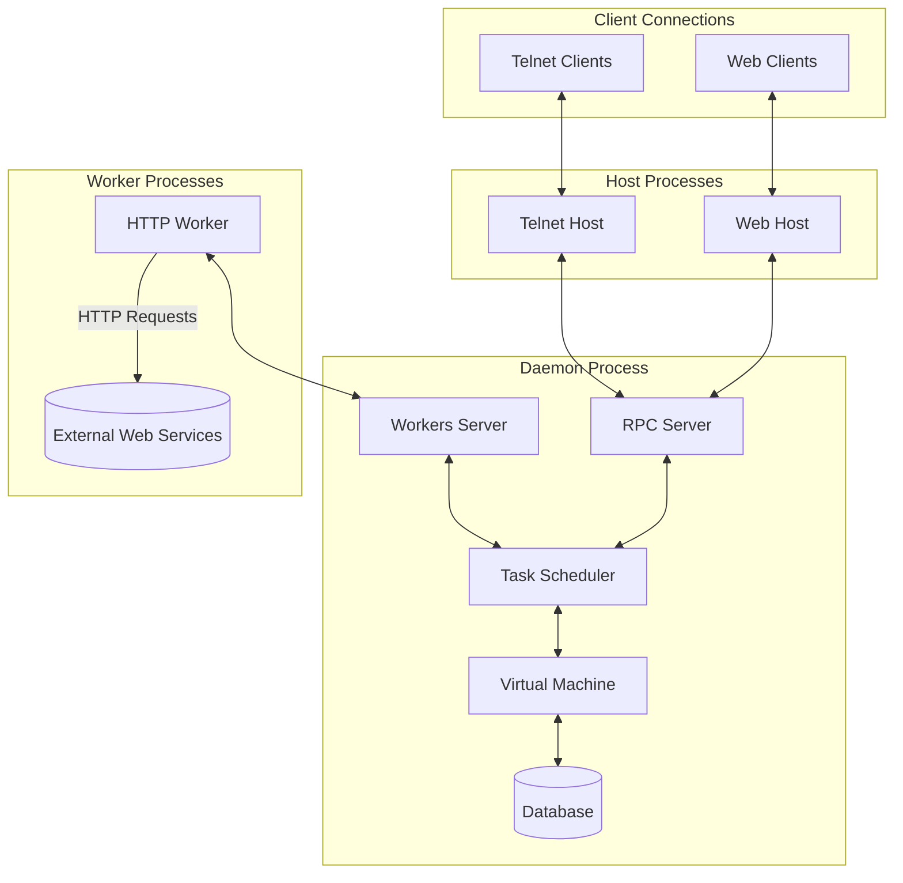
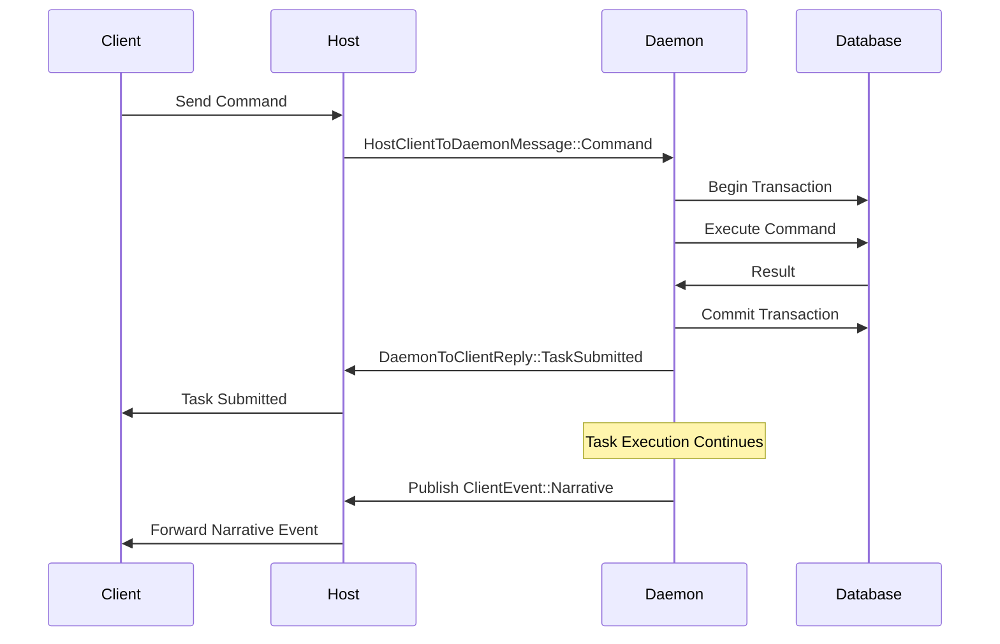
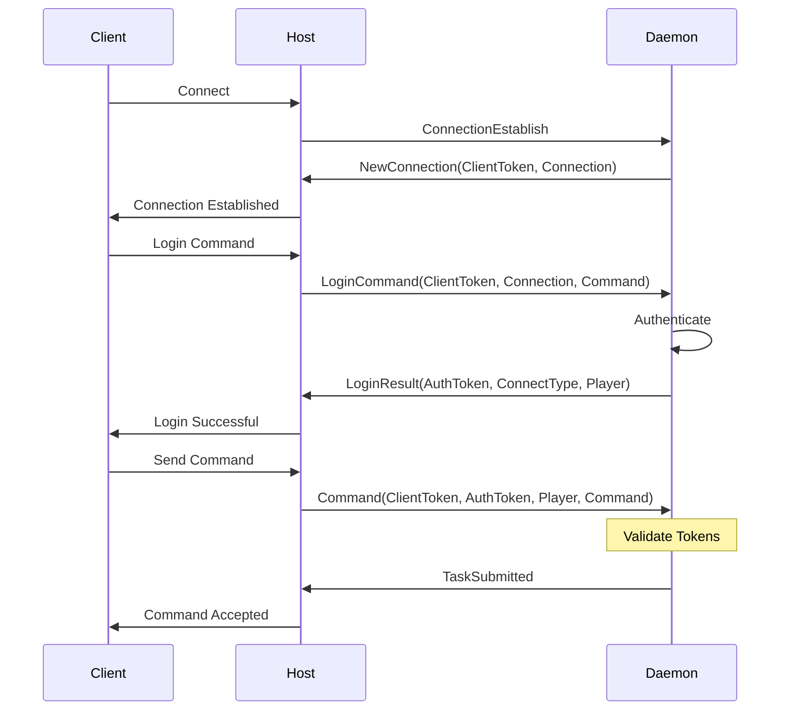

# mooR Messaging Layer Overview

## Introduction

The mooR RPC/IPC messaging layer is a critical component of the mooR system, providing the
communication infrastructure that connects different parts of the application architecture. It
enables the flow of messages between daemon, hosts, workers, and clients, forming the backbone of
the distributed system that powers mooR's virtual social spaces.

The messaging layer uses ZeroMQ (zmq/0mq) for inter-process communication, allowing for efficient
and flexible message passing between the various components of the system. 0mq supports multiple
messaging patterns, including request-reply and publish-subscribe.

When running purely on a single host, the IPC (Inter-Process Communication) transport can be used
for fast local communication.

When running in a distributed environment, TCP transport is used to communicate over the network. In
this manner, the daemon can run on one machine while the hosts and workers can run on different
machines, allowing for a scalable, flexible, and resilient architecture.

## Purpose

The messaging layer serves several key purposes:

1. **Process Isolation**: Separates the daemon (core server) from host processes that handle client
   connections
2. **Distributed Operation**: Allows hosts and workers to run on different machines from the daemon
3. **Protocol Management**: Handles the serialization and deserialization of messages between
   components
4. **Authentication**: Provides secure token-based authentication between system components
5. **Event Broadcasting**: Enables publishing events to multiple subscribers (hosts, clients,
   workers)

## Architecture Components

The mooR messaging layer follows a multi-process architecture with the following major components:

- **Daemon**: The core server process that manages the database, virtual machine, and task
  scheduling.
- **Hosts**: Processes that handle client connections, such as Telnet and WebSocket hosts.
- **Workers**: Background processes that perform specific tasks and communicate with the daemon,
  notably for executing outbound network (e.g. HTTP or even external database connections) requests
  initiated by the `daemon`.

Each of these components communicates with the others using 0MQ, and they can be independently
stopped and restarted, without shutting down the whole system. This allows for e.g. rolling updates
to the daemon or adding new hosts or workers without interrupting the service.

### 1. Daemon

The daemon is the central process that:

- Manages the embedded database
- Executes the MOO virtual machine
- Schedules and runs tasks
- Processes RPC requests from hosts and workers

The daemon is responsible for the core functionality of the system and acts as the main server,
playing the role that a traditional "MOO" server would play back in the day, but without the
`telnet` listen loop, which is handled by the host processes.

### 2. Hosts

Host processes are the interface between users and the daemon:

- They handle specific connection types (TCP, WebSocket)
- They relay commands from clients to the daemon
- They receive events from the daemon and forward them to clients
- Each host must register with the daemon

### 3. Workers

Worker processes are specialized components that:

- Perform specific background tasks
- Register with the daemon and receive work assignments
- Process requests and return results

### 4. Clients

Clients are user connections, managed by hosts:

- They authenticate with the system
- They send commands to be executed
- They receive narrative and system events from the daemon

## Communication Protocols

The messaging layer primarily uses ZeroMQ (zmq) for inter-process communication through:

### 1. Request-Reply Pattern

Used for direct communication between:

- Hosts and the daemon
- Workers and the daemon
- Clients (via hosts) and the daemon

### 2. Publish-Subscribe Pattern

Used for broadcasting events:

- Narrative events to client connections (CLIENT_BROADCAST_TOPIC)
- System events to hosts (HOST_BROADCAST_TOPIC)
- Work assignments to workers (WORKER_BROADCAST_TOPIC)

## Message Flow

The typical message flow in the mooR system works as follows:

1. **Client to Host**: A client sends a command to its host
2. **Host to Daemon**: The host forwards the command as an RPC to the daemon
3. **Daemon Processing**: The daemon processes the command, possibly creating tasks
4. **Daemon to Host**: Responses are sent back to the host that made the request
5. **Daemon to All Hosts**: Broadcast events are published to all relevant hosts
6. **Host to Client**: Hosts forward messages to the appropriate client connections

## Message Flow Diagram

## Authentication Mechanism

The messaging layer implements secure authentication using PASETO tokens:

1. : Authenticates clients to the daemon **ClientToken**
2. : Authenticates users (players) to the daemon **AuthToken**
3. : Authenticates hosts to the daemon **HostToken**
4. : Authenticates workers to the daemon **WorkerToken**

Each token has a specific footer marker:

- `MOOR_SESSION_TOKEN_FOOTER`
- `MOOR_AUTH_TOKEN_FOOTER`
- `MOOR_HOST_TOKEN_FOOTER`
- `MOOR_WORKER_TOKEN_FOOTER`

Tokens are created using asymmetric cryptography and have an expiration time, requiring periodic
renewal.

## Message Types

The messaging layer defines several key message types:

### Host-Daemon Messages

- : Messages sent from hosts to the daemon `HostToDaemonMessage`
  - RegisterHost: Register a host's listeners
  - DetachHost: Unregister a host
  - RequestPerformanceCounters: Request system metrics
  - HostPong: Response to a ping request

- : Responses from the daemon to hosts `DaemonToHostReply`
  - Ack: Acknowledge a message
  - Reject: Reject a host request
  - PerfCounters: System performance metrics

### Client-Daemon Messages

- : Messages sent from clients (via hosts) to the daemon `HostClientToDaemonMessage`
  - ConnectionEstablish: Create a new connection
  - LoginCommand: Authenticate a user
  - Attach: Connect to an authenticated user
  - Command: Execute a MOO command
  - And many others for programming, inspection, and interaction

- : Responses from the daemon to clients `DaemonToClientReply`
  - NewConnection: Connection established
  - LoginResult: Authentication result
  - TaskSubmitted: Command accepted for execution
  - And various other responses to client requests

### Worker-Daemon Messages

- : Messages from workers to the daemon `WorkerToDaemonMessage`
  - AttachWorker: Register a worker with the daemon

- : Responses from the daemon to workers `DaemonToWorkerReply`
  - Attached: Worker registration accepted
  - Ack: Generic acknowledgment

### Broadcast Events

- : Events broadcast to all hosts `HostBroadcastEvent`
  - Listen: Start listening on a port
  - Unlisten: Stop listening on a port
  - PingPong: Health check request

- : Events broadcast to all clients `ClientsBroadcastEvent`
  - PingPong: Health check request

- : Events targeted at specific clients `ClientEvent`
  - Narrative: In-world events
  - RequestInput: Request for user input
  - SystemMessage: System notifications
  - TaskError/TaskSuccess: Task execution results

## Health Monitoring

The messaging layer includes mechanisms for monitoring the health of components:

1. **Host Monitoring**:
   - The daemon periodically sends events to hosts `PingPong`
   - Hosts must respond with messages `HostPong`
   - Hosts that don't respond are considered dead and removed

2. **Client Monitoring**:
   - The daemon broadcasts events to clients `PingPong`
   - Hosts relay these to clients and send responses `ClientPong`
   - This helps track active connections

3. **Worker Monitoring**:
   - Workers must periodically renew their tokens
   - Workers that don't respond to requests are considered dead

## Error Handling

The messaging layer defines several error types:

- : Transport-level errors `RpcError`
- : Message-specific errors `RpcMessageError`
- : Task execution errors `SchedulerError`

These errors are propagated through the messaging layer to inform clients of issues.

## Authentication Flow Diagram

